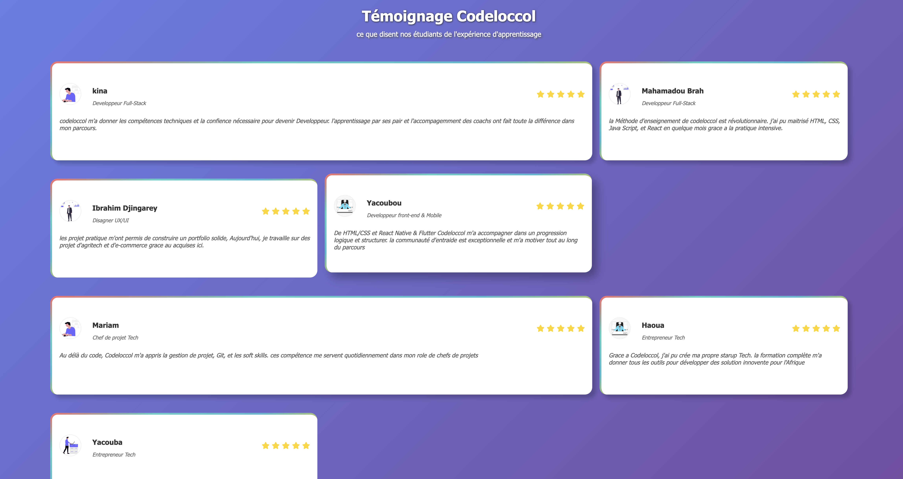
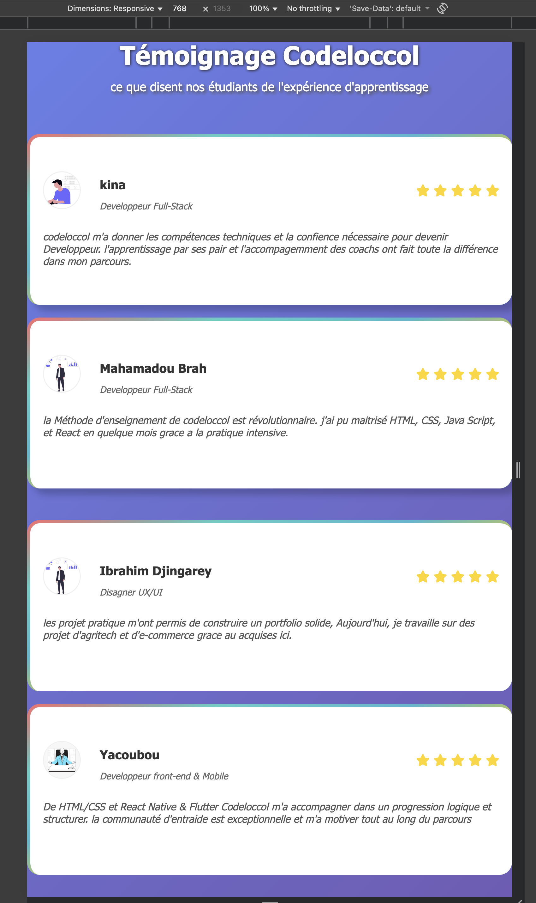
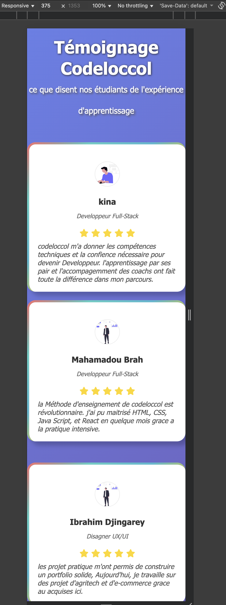

# Description
## Tesimonial Page
Le présent projet porte sur la conception d’une page web présentant, sous forme de grille, les témoignages d’étudiants issus de Codeloccol.
## Structures
- Structurer le contenu avec des balises HTML sémantiques.
- Mettre en forme la page grâce au CSS : couleurs, typographies, espacements, hover,animation, bordure etc.
- Intégrer des images, des icônes et des logos.
- Rendre la page responsive pour une expérience optimale sur tous les appareils.
- Créer une navigation claire et un pied de page complet avec des liens et des réseaux sociaux.
---
## Objectifs
- Découvrir la structure de base d’une page HTML
- Utiliser les balises HTML sémantiques
- Appliquer des styles CSS : Lier une feuille de style externe et personnaliser l’apparence de la page.
- Responsive design pour adapter la page aux différents écrans.
- Structurer et organiser son code séparez le contenu (HTML) et la présentation (CSS).
## Fonctionnalités

- Design constituer  de  trois parties sur unela page
- Responsive (ordinateur, tablette et mobile)
-  interactifs avec effet hover, et animation 
- Structure HTML sémantique et code CSS organisé
- Flexbox pour une bonne structure

## Technologies utilisées

- HTML5
- CSS3

## Responsivité

- Ordinateur,Tablette et Mobile : un conteneur avec des sections
- Tablette et Mobile : sections empilées verticalement
- Textes centrés et adaptés aux petits écrans
-  image, texte, icone, bordure lineaire gradients

## Structure du projet

### Tesimonial Page
- index.html
- style.css 
- README.md 

